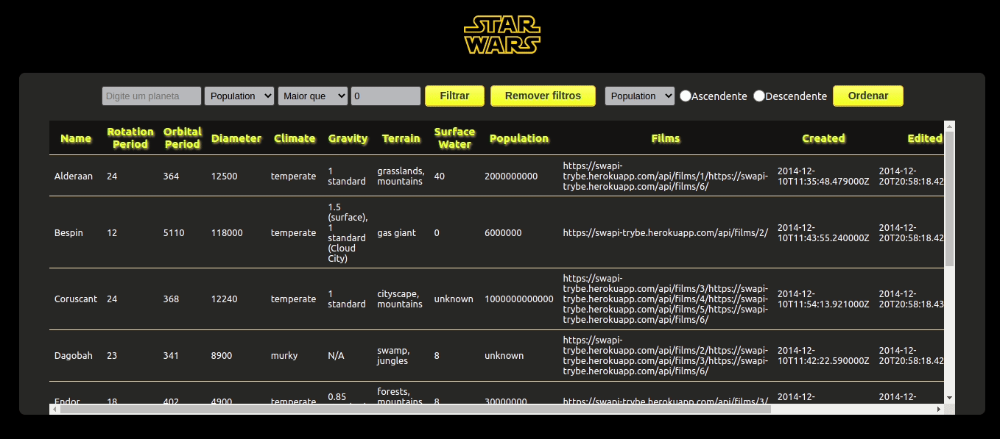

# STAR WARS PLANETS 👾

Project developed in the Front-end Module at the [Trybe](https://www.betrybe.com/) course.

This project develops a filter list of planets from the Star Wars universe.

---
 

🎯 **Objective**: put into practice the following abilities:
* Manage states with Context API
* Use the following hooks:
  * useState
  * useEffect
  * useContext

 

🛠️ **Used tools:**
* React
* JSX
* Context API
* Hooks
* CSS

 

---

### 🔗 Project Links
* [Page](https://queite.github.io/trybewallet/#/)

---

### 🔎 Project Preview

&nbsp;

All [Trybe](https://www.betrybe.com/) projects use `linters`, `Git` and `GitHub`.
